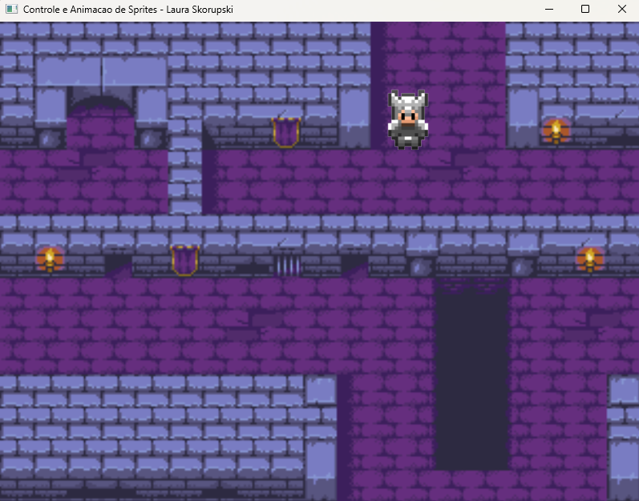

### Controle e Animação de Sprites

1. **O que Esse Projeto Realiza?**
   - Este projeto tem como objetivo aplicar os conceitos de aplicação de controle e animação de Sprites.
   - Ao executá-lo, ele deverá abrir a seguinte tela:
  
     

  - Para controlar o personagem, basta usar as teclas das setas.

2. **Configuração do Ambiente**:
   - Para rodar o projeto é necessário adicionar as bibliotecas utilizadas por ele (disponíveis na pasta Dependencies).
